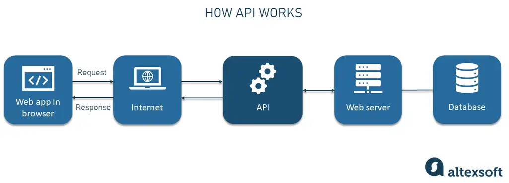

# APIS
- [APIS](#apis)
  - [What are APIs? How are they used and why are they so popular?](#what-are-apis-how-are-they-used-and-why-are-they-so-popular)
  - [What is a REST API? what makes an API RESTful? What are the REST API guidelines?](#what-is-a-rest-api-what-makes-an-api-restful-what-are-the-rest-api-guidelines)
- [Pokeman Game](#pokeman-game)

**API stands for Application Programming Interface**


## What are APIs? How are they used and why are they so popular?

- APIs are mechanisms that enable two software components to communicate with each other using a set of definitions and protocols.

 - Interface can be thought of as a contract of service between two applications. This contract defines how the two communicate with each other using requests and responses.

 - Their API documentation contains information on how developers are to structure those requests and responses.

**API works as a middle layer between the client and the server, making it possible to send data requests and responses.**



## What is a REST API? what makes an API RESTful? What are the REST API guidelines?

- REST (Representational State Transfer) API,  is a software architectural style for designing networked applications.
- It is a set of principles and constraints used to **create web services that are scalable, stateless, and can be easily consumed by clients.**
- REST APIs work by fielding requests for a resource and returning all relevant information about the resource, translated into a format that clients can easily interpret <br>


**The Six Rules of REST APIs:**

1. **Client-Server Separation:** the client and server can only interact in one way: The client sends a request to the server, then the server sends a response back to the client. 
2. **Uniform interface:** REST APIs provide a uniform and consistent interface for accessing and manipulating resources
3. **Stateless:** - The server does not maintain any client state.  This allows for scalability and reliability, as servers can handle requests independently without relying on previous interactions. 
4. **Layered System:** layering means breaking down the system into different levels, each with its specific role. This enables flexibility and scalability, accommodating intermediaries like proxies and load balancers without disrupting the system.
5.**Cacheability:** Responses from the server should indicate whether they can be cached or not. This helps improve performance by allowing clients to reuse previously obtained responses.
5. **Code on Demand (Optional):** The final REST principle is optional. If desired, an API can send computer code to clients in its response. This empowers the client to run the code in its own backend.


The format of a RESTful API has three main components: 

1) URL endpoint

2) HTTP verb 

3) Body


**URL endpoint:** Is a URL link that represents the resources we want access.

For example, ```example.com/surveys``` 


**HTTP verb:** Tells the server what we want to do with the URL  For example, a ```POST``` request means we want to create a new survey template and a ```GET ```request means we want to view an existing survey template.


***Body message:*** Is an optional custom payload which contains a message with the properties and values we want to use to create or update a given resource.

# Pokeman Game

Welcome to the [Pokémon Game](https://github.com/zyusuf88/API/blob/main/Pok%C3%A9mon_game.py) <br>

 
Welcome to the Pokémon game! Choose your Pokémon from a selection of 100 creatures. Beware! Your opponent's taller Pokémon could tip the battle! <br>

To get started, make sure you have the requests library installed. If not, you can install it by running: `pip install requests`


